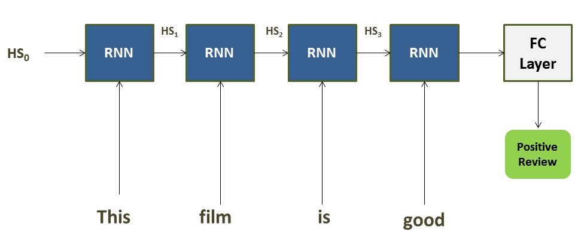

# NLP-Sentiment and Recommendation System (Final Project for EECS-731 Data Science)

Sentiment Analysis using Natural Language Processing

Project Organization
------------

    ├── LICENSE
    ├── README.md                   <- The top-level README for developers using this project.
    ├── data
    │   ├── external                <- Data from third party sources.
    │   ├── interim                 <- Intermediate data that has been transformed.
    │   ├── processed               <- The final, canonical data sets for modeling.
    │   └── raw                     <- The original, immutable data dump.
    │
    ├── notebooks                   <- Jupyter notebooks. Naming convention is a number (for ordering),
    │   └── sentiment_prediction    <- Sentiment prediction
    |
    ├── reports                     <- Generated analysis as HTML, PDF, LaTeX, etc.
    │   └── figures                 <- Generated graphics and figures to be used in reporting

--------

# Project Objective

This project aims at developing following two systems:

1) **binary and multi-class sentiment analysis** and 

2) **Movie Recommendation system**.

This readme first goes through the sentiment analysis part, followed by discussion on recommendation system in the second part.

# Binary and Multi-class Sentiment Analysis System

**Used Datasets**

We have used two datasets for seniment analysis task. 

<ul>
<li>IMDB reviews daaset with binaly sentiment labels (Positive, Negative reviews)</li>
<li>Tweets dataset with 3-way sentiment labels (Pleasant, UnPLeasant, Neutral)</li>
</ul>

**DEPLOYED NLP MODELS**

For sentiment analysis modeling, we have employed three deep NLP based models, as follows:

<ul>
<li>Recurrent Neural Network (RNN) Based (aka The Baseline)</li>
<li>Bi-grams embedding Based (aka Model1)</li>
<li>Convolutional Neural Network (CNN) Based (aka Model2)</li>
</ul>

Next, we briefly explain these three models and their training details.

